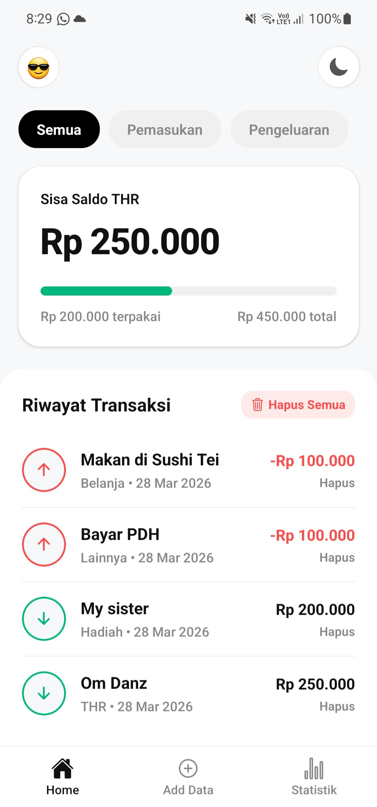

### THR Manager App

## Informasi Mahasiswa
- **Nama** : Zulfikar Hasan  
- **NIM** : 2410501016  
- **Opsi Tugas** : B (THR Manager App)  

---

## Deskripsi Aplikasi
THR Manager App adalah aplikasi mobile berbasis React Native (Expo) yang dirancang untuk membantu pengguna mencatat dan mengelola arus kas uang Tunjangan Hari Raya 
(THR). Melalui aplikasi ini, pengguna dapat dengan mudah melacak daftar pemasukan dan pengeluaran, melihat sisa saldo secara real-time, 
menyaring riwayat transaksi, serta memantau statistik pengeluaran berdasarkan kategorinya. Aplikasi ini juga terintegrasi dengan penyimpanan lokal (AsyncStorage) 
sehingga seluruh data transaksi aman dan tidak hilang saat aplikasi ditutup.


---

## Hooks yang Digunakan

### 🔹 useState
Digunakan untuk mengelola state lokal:
- `AddScreen.js` → input form (type, title, amount, category)
- `HomeScreen.js` → status filter aktif
- `ThemeContext.js` → status dark mode

---

### 🔹 useEffect
Digunakan untuk menangani *side effects*:
- `TransactionContext.js`:
  - Load data dari AsyncStorage saat pertama kali aplikasi dijalankan
  - Menyimpan data setiap kali transaksi berubah

---

### 🔹useContext 
Digunakan secara luas di berbagai komponen (seperti `HomeScreen`, `AddScreen`, `SummaryScreen`, `BalanceCard`, dan `InsightCard`) 
untuk mengonsumsi data global dari `TransactionContext` (data transaksi) dan `ThemeContext` (tema warna terang/gelap) secara langsung tanpa perlu melakukan 
***props drilling***.

---

### 🔹 useReducer
Digunakan sebagai pengelola global state transaksi:

**Action Types:**
- `SET_TRANSACTIONS` → Load data awal
- `ADD_TRANSACTION` → Tambah transaksi
- `DELETE_TRANSACTION` → Hapus transaksi berdasarkan ID
- `CLEAR_ALL` → Reset semua data

---

### 🔹 Custom Hook: `useWallet`
Lokasi: `src/hooks/useWallet.js`

Fungsi:
- Menghitung total pemasukan (*totalIncome*)
- Menghitung total pengeluaran (*totalExpense*)
- Menghitung saldo akhir (*totalBalance*)

Digunakan ulang di:
- `HomeScreen`
- `SummaryScreen`

---

## Screenshot Preview




## Cara Menjalankan

Aplikasi ini menggunakan **Expo**.

### 1. Clone Repository
```bash
git clone <URL_REPOSITORY>
```

### 2. Install Dependencies
```bash
npm install @react-navigation/native @react-navigation/bottom-tabs react-native-screens react-native-safe-area-context @react-native-async-storage/async-storage
```

### 3. Jalankan Aplikasi
```bash
npx expo start
```

---
### Poin Bonus Tambahan
- **Dark Mode menggunakan Context API terpisah `ThemeContext` yang terintegrasi secara dinamis ke seluruh komponen dan navigasi aplikasi.**
- **Visualisasi data (chart/progress bar) dengan animasi dinamis pada komponen `BalanceCard` dan statistik kategori untuk merepresentasikan persentase pengeluaran terhadap pemasukan.**

